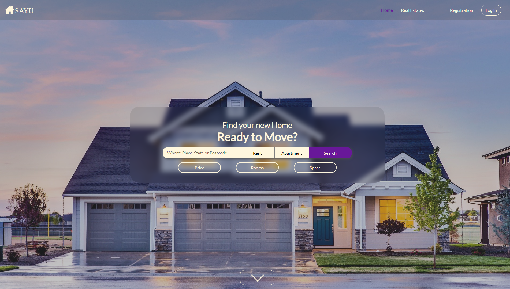

# 📄 Table of Contents  
[Introduction](#introduction)  
[Set up](#)   

  

<h1 align="center">
 sayu-real-estate.herokuapp.com - v1
</h1>

An application for real estate built with React - Redux - Styled Components - Leaflet - React Router Dom and hosted with <a href="https://heroku.com/" target="_blank">Heroku</a>

  

## 🛠 Set Up

1. Install React ^16.12.0
2. Install React-Dom ^16.12.0
3. Install React-Redux ^7.1.3
4. Install Redux ^4.0.5
5. Install Redux-Logger ^3.0.6 
6. Install React-ID-Generator ^3.0.0
7. Install React-Leaflet ^2.6.1
8. Install React-Router-Dom ^5.1.2
9. Install Styled-Components ^4.4.1
